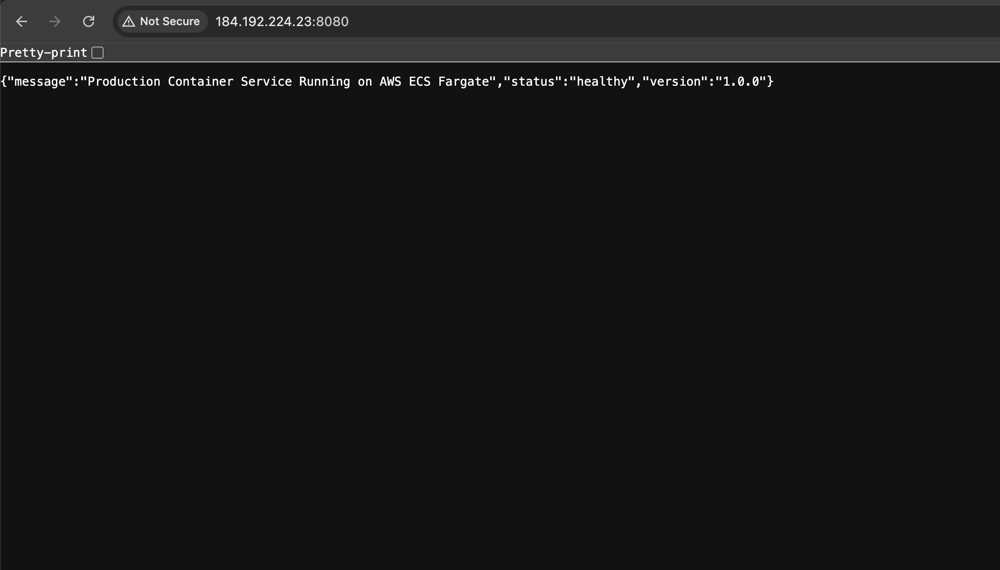

# Production Web Service on AWS ECS Fargate

This repository contains a containerized Python Flask web service automated with GitHub Actions and deployed to **AWS ECS Fargate** via **Amazon ECR**.

---

## 📸 Application Preview

---

## 🛠️ Tech Stack & Architecture

* **Language/Framework:** Python, Flask
* **Containerization:** Docker
* **Registry:** Amazon Elastic Container Registry (ECR)
* **Compute:** AWS ECS (Fargate)
* **CI/CD:** GitHub Actions

---

## 🚀 Local Development

1. **Clone the repository:**

  
 bash
git clone https://github.com/daniyalmr99/my-web-app.git
cd my-web-app

2. **Build and run with Docker:**
bash
docker build -t my-web-app .
docker run -p 8080:8080 my-web-app

3. **Access the application:**

   Open `http://localhost:8080` in your browser.
