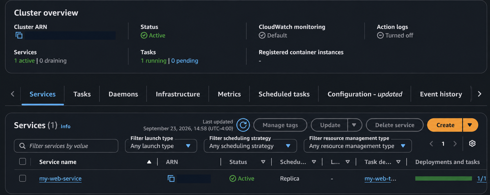

# Production Web Service on AWS ECS Fargate

This repository contains a containerized Python Flask web service automated with GitHub Actions and deployed to **AWS ECS Fargate** via **Amazon ECR**.

---

## 📸 Application Preview


### ECS Service Running



---

## 🛠️ Tech Stack & Architecture

* **Language/Framework:** Python, Flask
* **Containerization:** Docker
* **Registry:** Amazon Elastic Container Registry (ECR)
* **Compute:** AWS ECS (Fargate)
* **CI/CD:** GitHub Actions

---

## 🚀 Local Development

1. **Clone the repository:**

```bash
git clone https://github.com/daniyalmr99/my-web-app.git
cd my-web-app
```

2. **Build and run with Docker:**

```bash
docker build -t my-web-app .
docker run -p 8080:8080 my-web-app
```

3. **Access the application:**

Open `http://localhost:8080` in your browser.

---
   ## How It Works

The Flask application is packaged into a Docker container and pushed to Amazon ECR.  
Amazon ECS Fargate runs the container without requiring any EC2 server management.

GitHub Actions handles the deployment workflow by building the Docker image, pushing the updated image to ECR, and deploying the new version to ECS.

---

## CI/CD Workflow

1. Code is pushed to GitHub.
2. GitHub Actions starts the deployment workflow.
3. A new Docker image is built.
4. The image is pushed to Amazon ECR.
5. ECS deploys the updated container.
6. The running service is verified in the ECS cluster.

---

## What I Learned

This project helped me get more comfortable working with containers and automated deployments.

I learned how to:

- Build and run a Flask application inside Docker
- Store Docker images in Amazon ECR
- Deploy containers using ECS Fargate
- Work with ECS task definitions and services
- Automate deployments with GitHub Actions
- Troubleshoot container and deployment issues

---

## Future Improvements

A few improvements I would add next:

- Application Load Balancer
- HTTPS with ACM
- Custom domain with Route 53
- CloudWatch logging and monitoring
- Multiple ECS tasks for higher availability
